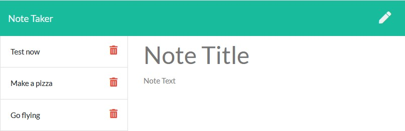

# Note Taker

   

## Description
Note Taker is a fulfillment for UC Berkeley bootcamp for creating an Express.js back end application for viewing, creating, and deleting notes saved to a json file. The objective was to build a back end and connect it to the already created front end, and then deploy to [Heroku](https://salty-forest-11453.herokuapp.com/).



## Table of Contents
* [Installation](#installation)
* [Usage](#usage)
* [Contributing](#contributing)
* [Tests](#tests)
* [Questions](#questions)

## Installation
Note Taker requires [node.js](https://nodejs.org/en/) and express.js be installed. Clone the github directory from [here](https://github.com/yooperjb/note_taker). To install express use:

```
npm install
```

## Usage
Because Note Taker uses an express back end server, to start Note Taker use
```
npm start
```

## Contributing
There are many ways to contribute to this project if you are interested.

* [Submit bugs and feature requests](https://github.com/yooperjb/note_taker/issues)
* Review [source code changes](https://github.com/yooperjb/note_taker/pulls)

## Tests
Because of time constraints no tests have been setup for the application at this time. 

### Questions
Any questions or feedback regarding this project can be sent directly to my [email](mailto:jason.barnes@humboldt.edu), or submitted as outlined in the [contributing](#contributing) section. This project and others can be found at my [Github page]('https://github.com/yooperjb').